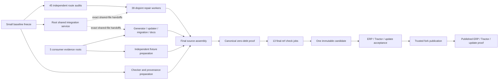

# UltraModern.js: up to 40 concurrent workers

**Planning only.** This replaces the coarse 27-plan scheduling topology with **127 bounded nodes, 338 pending tasks and 266 dependencies**. The accepted zero-debt and native-usage [success criteria remain unchanged](um-zero-20260909-overview.md). Strict graph validation passes with zero errors or warnings.

The configured budget is 50 threads. Dispatch up to **40 active leaf workers**, preserving ten slots for the primary, integration, checking and recovery. All future workers are leaves. The graph has a maximum structural antichain of 55 nodes; a capped topological simulation reaches 40 active nodes without exceeding the budget. This measures available parallelism, not elapsed-time savings.

## What can run together

- **45 independent identity audits** cover all **447 affected source identities**, including all 440 historical divergence failures and all 21 current governed import edges. Each releases its own repair after its own legal route and consumed interfaces are proved.
- **39 component source/documentation workers** have disjoint original file reservations. Five package-evidence lanes and the generated-changelog lane feed one shared integration owner.
- **Five independent consumer evidence roots** prepare journeys, generated-artifact contracts, measurements, historical cohorts and retirement decisions while the root freezes the source baseline.
- Generator projection, update transaction, legacy transformations, native guidance and independent fixture preparation have separate owners. Transaction and migration leaves can progress together after their small shared contract is stable.
- **13 final-ref verification jobs** cover component areas, generator, publication tooling, types/exports, style/ledger and required native platforms using private mutable outputs.
- ERP, Tractor and update acceptance consume one immutable candidate. Published ERP, Tractor and customized update proof are separate jobs. Shared host ports are real resource locks, not fake source dependencies.

## Continuous dispatch

Start the small root baseline check alongside the five consumer evidence nodes. As soon as refs/hashes are frozen, fill the ready queue from the 45 audit lanes plus checker preparation; the root opens its shared integration service. **Do not wait for every audit before starting repairs.** Refill available slots whenever an individual node finishes and its successor is actually ready.

The diagram groups nodes for readability; [selection.json](notes/um-parallel-20260909/selection.json) is the exact DAG. Real missing upstream seams become narrowly targeted dependencies of their consumers and final integration. Unrelated workers continue while those seams await review. Proposed upstream code never counts as landed source.

## Ownership and integration

[ownership.json](notes/um-parallel-20260909/ownership.json) assigns every original identity once. Proposed fork destination directories do not grant write permission: each audit must obtain exact new-path reservations and actual interface delivery before its worker writes. Source barrels retain their assigned owner; manifest export maps, generated lockfiles/cohort/changelogs/mirrors and the ledger go through the root’s serialized shared-file service. The final assembly node closes that service; it does not delay incremental handoffs.

Use private build/test/acceptance roots. ERP/Tractor/default-port update phases share a mutex on one host; real isolated environments can run them concurrently. Measurements require a dedicated host or scheduler-wide quiescence. Full details are in the [resource and dispatch policy](notes/um-parallel-20260909/resource-policy.md).

No allowance expansion, scope narrowing, identity rename, app shim, manual generated-file edit or duplicate updater makes this graph succeed. The fixed audited base, complete-PR 20-line caps, same-PR ledger, genuine upstream provenance, zero current imports, native APIs, same-contract update preservation, rollback and real published-byte acceptance all remain mandatory.

## Launch bundle

- [Execution index: every node, owner, prerequisite and br issue](notes/um-parallel-20260909/execution-index.md)
- [Exact graph selection and dependency overlay](notes/um-parallel-20260909/selection.json)
- [Handoff identity and excluded old plans/templates](notes/um-parallel-20260909/handoff.json)
- [Current launch frontier](notes/um-parallel-20260909/launch-frontier.json)
- [Coverage and concurrency evidence](notes/um-parallel-20260909/concurrency-proof.json)
- [Replay instructions](notes/um-parallel-20260909/README.md)

Graph ID: `um-parallel-20260909`. Selection hash: `c4b9ebfc51`. Execution epic: `modernjs-cdhz.29`, deferred. Existing `modernjs-piop` remains the canonical zero-debt gate. The old 27 plans are excluded from the runnable selection and mapped to these owners; no implementation task is marked completed by this redesign.
